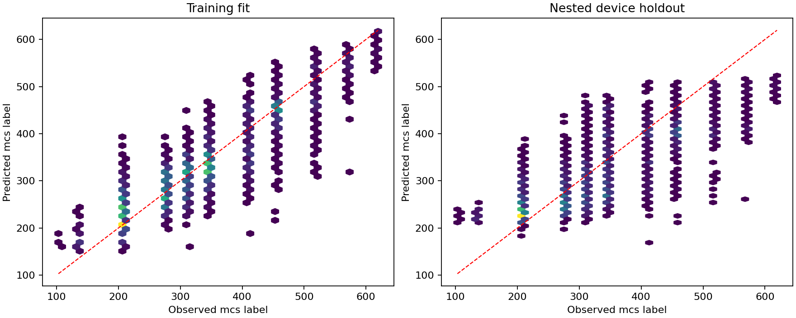

# 问题一：实际复现结果

本报告由 `scripts/run_q1.py` 根据真实运行结果生成。仅覆盖问题一。

## 论文结果与本次结果

原文第30页表5-3明确描述训练集拟合指标。下表同样比较训练拟合，不视为独立测试精度。
数据中的 `mcs` 是原始数值标签，程序不将其擅自重编码为整数，也不宣称其单位为 Mbps 或 dB。

| 指标 | 论文表5-3 | 本次训练拟合 |
|---|---:|---:|
| n | 20369 | 20369 |
| mse | 1652.976 | 1667.29 |
| rmse | 40.657 | 40.8325 |
| mae | 30.952 | 31.2597 |
| r2 | 0.828 | 0.826953 |

论文参数 α=2.2、β=0.29648733946825756；本次参数 α=2.8、
β=0.767381874168。本次参数来自运行搜索，未用论文成绩反推或替换。
原论文主程序、平滑实现、随机状态和噪声分母 ε 未完整公开，因此本工程为依据正文及附录的可执行重建，不承诺逐位或指标完全一致。

HGBR的融合权重为 1。本次权重达到1，融合结果等于HGBR输出，不能声称融合额外提升了本次成绩。

## 独立设备隔离验证

全部外层测试样本合并：融合模型 R²=0.615880，RMSE=60.835442，MAE=48.661315。每一外折都仅使用其余设备重新搜索 EESM 参数、选择 HGBR 和估计融合权重。这是跨设备迁移检验；只有三个设备，不能代表所有部署环境。

详见 [指标文件](../outputs/q1/device_holdout_metrics.json)、
[逐样本折外预测](../outputs/q1/device_oof_predictions.csv)。
这部分另行评估论文算法，不能与论文训练表5-3直接比较为优劣。

## 官方无标签 B 集预测

| 设备 | 待预测行数 | 有效预测 |
|---|---:|---:|
| 341c-f0d4-70be | 7712 | 7712 |
| bc98-2983-907b | 6161 | 6161 |
| d0c1-bfe4-18f0 | 6496 | 6496 |

B 集没有真实标签，因此没有对 B 集计算准确率、R² 或 RMSE。
[总预测表](../outputs/q1/valid_predictions.csv)同时给出每条样本的 EESM 等效量、
ISO、HGBR、连续融合值以及吸附到训练标签集合后的 `label`。
`required/` 下每个 CSV 采用原始索引及 `mcs` 两列。异常行保留并标识，不会静默移位。

## 数据与复现实验

原始6个 Excel 的字节数、SHA-256、清洗统计见
[数据审计](../outputs/q1/data_audit.json)。
[派生数据说明](../data/derived/README.md)记录逐载波 SINR 与源行的对应关系，
可直接重跑模型；从原始 CSI 重建需下载 Drive 中相同文件。
所有版本、种子、耗时与模型细节见 [metrics.json](../outputs/q1/metrics.json)。
默认种子42；源码、派生数据和本次结果已纳入版本管理。

## 数据结构重复检查

训练与待预测集各有20,369个精确唯一的SINR行，跨集合完全相同的SINR行为
0。但去除噪声影响、将每个子载波的天线总能量保留11位有效数字后，
训练/待预测集分别只有 27 /
25 种能量向量，
待预测集有 20304 条记录的能量结构在训练集出现。
因此不能仅凭行数或精确SINR无重叠就认为所有样本独立。
能量求和丢失复数相位和空间结构，此检查不证明原始CSI相同，也不证明标签泄漏。
计算方法及完整统计见 [数据重叠审计](../outputs/q1/data_overlap_audit.json)。

论文公式、附录代码与本工程的详细对应见
[问题一-论文代码对照](问题一-论文代码对照.md)。
