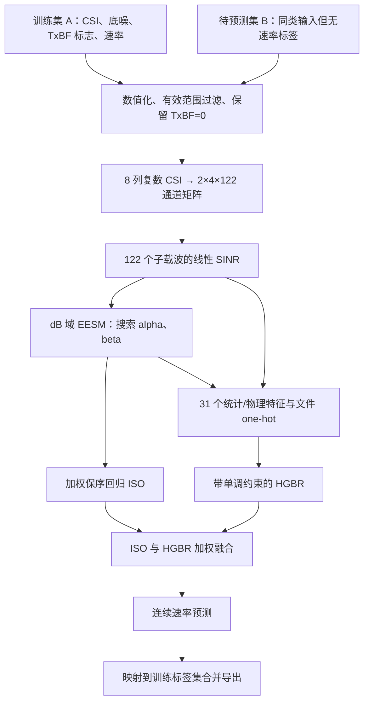

# 问题一：论文、公式与代码对应说明

本工程只复现优秀论文《机器学习驱动的面向 MIMO-OFDM 的链路速率预测》的**问题一：关闭发送波束赋形时的链路速率预测**。依据为第5章（PDF第23–33页）和附录2（第57–65页）。本文件说明各部分如何对应，以及无法从论文唯一确定的细节；本次实际数值见[复现结果](问题一-复现结果.md)和[机器可读指标](../outputs/q1/metrics.json)。

这里的“复现”指根据正文和公开的关键代码重建可运行流程。作者没有提供完整主程序、随机种子和运行环境，正文与附录也有差异，因此不能把重新训练得到的数值自动称为与论文逐位一致。默认 `paper_appendix` 协议优先遵循附录的计算与训练行为，并明确标注补全的工程约定。

## 1. 从输入到输出

数据集 B 没有真实速率标签，因此 B 的输出是**预测结果**，不能据此计算测试集准确率、RMSE 或 R²。论文把 `mcs` 称为索引，但表5-4至5-6给出的值为206.5、275.3等实际数值标签；本工程保留原始标签的数值含义，不自行重编码为0、1、2。

## 2. 论文到实现的索引

| 论文位置 | 论文内容 | 实现入口 | 说明 |
|---|---|---|---|
| §5.2，p24；伪代码p27–28 | Excel加载、TxBF与底噪过滤 | [`data.py`](../src/gmcm25b/data.py)：`load_dataset` | 同时保留来源信息，便于分组与逐文件导出 |
| §5.2，p24 | CSI字符串解析 | [`data.py`](../src/gmcm25b/data.py)：`parse_csi` | 8列，每列122个复数；校验形状和数值 |
| 式(5.1)、(5.2)，p24；伪代码p28 | 底噪与逐载波SINR | [`data.py`](../src/gmcm25b/data.py)：`load_dataset` | 采用伪代码中的信号功率 `/1000` 约定 |
| 式(5.3)–(5.8)，p24–25；附录p57–58 | EESM降维 | [`features.py`](../src/gmcm25b/features.py)：`eesm_db` | 按附录先转dB，再指数映射，使用稳定对数计算 |
| §5.3.1、§5.4，p25、29；附录p57、59–61 | alpha/beta搜索与CV | [`models.py`](../src/gmcm25b/models.py)：`ModelConfig`、`fit_model` | 网格与随机邻域细化；按设备分组 |
| 式(5.9)、(5.13)，p26、29；附录p58–61、64 | 加权ISO与ISO折外预测 | [`models.py`](../src/gmcm25b/models.py)：`fit_model` | 保序回归，标签逆频权重，超范围截断 |
| §5.3.3，p26；附录p62–64 | HGBR的统计与物理特征 | [`features.py`](../src/gmcm25b/features.py)：`build_meta_features` | 31个基础特征，加训练文件one-hot |
| §5.3.3–5.3.4，p26；附录p64–65 | HGBR三个候选配置 | [`models.py`](../src/gmcm25b/models.py)：`ModelConfig`、`fit_model` | `eff_db`正单调约束；默认按附录训练R²选择 |
| 式(5.10)、(5.14)，p26、30；附录p65 | 融合权重 | [`models.py`](../src/gmcm25b/models.py)：`fit_model` | 默认保留附录的方差分母，见第6节 |
| 伪代码p28–29；表5-4至5-6，p31–32 | 推理、最近标签映射、结果导出 | [`run_q1.py`](../scripts/run_q1.py) | 保存连续值、离散标签与来源信息 |
| 表5-2、5-3，p30 | 参数与训练拟合对比 | [`run_q1.py`](../scripts/run_q1.py)；[复现结果](问题一-复现结果.md) | 论文指标与本次运行指标分开记录 |

论文中的图5-1、图5-2对应上述整个流程；图5-3至图5-5属于拟合关系和残差分布诊断，不是额外的模型训练步骤。

## 3. 数据清洗与物理量

保留 `beamforming_en=0`，并将 `beamforming_en`、`noise_floor` 和训练集 `mcs` 转为数值。底噪有效范围为闭区间 `[-120,-50] dBm`；无效值、缺失值或无法构成完整CSI的样本需要在清洗记录中说明。

论文p24把CSI误写为“12列”，但给出的 `csi_matrix_r0_c0 … csi_matrix_r1_c3` 和 `2×4×122` 形状对应的是**8列**。这8列代表2个接收端口与4个发送端口，每列含122个子载波的复数系数。

底噪换算使用式(5.1)：

$$
P_{\mathrm{noise}}=10^{(NF-30)/10}\quad\mathrm{W}.
$$

本工程采用p28伪代码的SINR定义：

$$
\gamma_k=\frac{\sum_{r=0}^{1}\sum_{t=0}^{3}|H_{r,t,k}|^2/1000}{P_{\mathrm{noise}}/122+\varepsilon},\qquad k=0,\ldots,121.
$$

这里有两处必须披露的约定：

- 正文式(5.2)没有 `/1000`，伪代码有。复现选择伪代码，不能据此断言CSI系数已获得绝对物理功率标定。
- 伪代码写了 `epsilon`，却没有给出数值。本工程采用 `epsilon=0`，因为合法底噪换算后分母严格为正，避免任意常数支配极小噪声功率。这是补全约定，不是论文公布的数值。

p23提到“时间同步”，但未给出可执行的时差过滤阈值；前文也把时戳有效对齐作为假设。因此不自行添加时间窗口或删行规则。类似地，p23提到“轻量近邻平滑”，而关键代码没有邻居定义、窗口长度、权重或边界处理，本复现不声称重建了这个未公开的步骤。

## 4. EESM与保序回归

### 4.1 实际使用的映射域

附录p58的核心计算是：

$$
g_k=\operatorname{clip}(10\log_{10}(\max(\gamma_k,10^{-300})),-200,200),
$$

$$
e(\alpha,\beta)=-\alpha\log\left(\frac1{122}\sum_{k=0}^{121}\exp\left(-\frac{g_k}{\beta}\right)\right).
$$

指数求和通过减去最大指数的稳定计算实现，防止溢出。函数输出先裁剪到 `[-300,300]`，ISO输入默认进一步裁剪到 `[-200,200]`。

这是附录规定的**dB域指数映射**。通常先对线性SINR做指数映射、再换算dB的EESM与它并不等价；本工程为了对应论文附录保留上述计算，避免以另一种公式替代后继续宣称严格一致。

### 4.2 搜索设置

附录默认alpha从1.0到6.0、步长0.2，共26点；beta取40个对数等距点与 `0.1,0.6,…,19.6` 的并集，共79点。每组参数在各训练折拟合ISO，在验证折计算MSE，按**各折MSE的算术平均**选择。该数值不一定等于按所有验证样本加权后的整体OOF MSE。

粗搜后围绕最优候选、前6候选和4个偏移中心分别作30次局部随机扰动。alpha扰动范围为±0.3且下限1.0，附录局部搜索未限制alpha上限6.0；beta乘以 `[0.8,1.25]` 内随机数后限制到 `[0.1,20]`。复现固定随机种子以便再次运行，作者附录未公开该种子。

alpha是正比例因子。未触发裁剪时，改变alpha不改变样本排序，ISO可以吸收输入尺度变化，因此alpha通常不能通过这种流程唯一识别。裁剪饱和又会使不同alpha产生不同信息损失。论文报告的alpha应视为该实现和搜索协议下的参数，不能单凭它推导唯一物理解释。

### 4.3 分组与权重

代码优先用 `sta_mac` 分组，无该字段时用来源文件。附录设置最多5折，但实际使用 `min(5,独立组数)`。本数据的关闭TxBF场景有3个设备组，因而实际为**3折GroupKFold**；“5折”是配置上限。

ISO按式(5.9)最小化带权平方误差并施加单调不降约束。权重根据保留3位小数后的标签逆频次计算，再归一化为均值1；超出训练输入范围时使用边界预测。

附录有一个训练验证隔离差异：搜索EESM时先从全量标签计算权重，再取训练折子集；生成ISO OOF时却在每个训练折单独计算权重。默认 `paper_appendix` 协议应记录这一行为，不能把其搜索分数称为完全无泄漏的独立泛化估计。

## 5. HGBR特征和训练

`build_meta_features`构造 `31+G` 个特征，其中G为训练文件来源的数量。

| 类别 | 个数 | 内容 |
|---|---:|---|
| 线性SINR统计 | 11 | 均值、标准差、最小、最大、10/25/50/75/90分位数、偏度、超额峰度 |
| dB SINR统计 | 9 | 均值、标准差、最小、最大、10/25/50/75/90分位数 |
| 阈值占比 | 3 | 线性SINR大于1、3、10的比例 |
| 全局映射 | 2 | `eff_db`、`log(1+10^(eff_db/10))` |
| 三段频域统计 | 5 | 三段EESM、其极差、其方差 |
| 底噪 | 1 | `noise_dbm` |
| 文件来源 | G | 训练文件one-hot，推理复用训练列顺序 |

统计特征计算前将线性SINR下限设为 `1e-12`。标准差和方差使用总体形式，即 `ddof=0`。122个载波按Python切片 `[0:40]`、`[40:81]`、`[81:122]` 分段；段内EESM输出裁剪到 `[-300,300]`，与ISO输入的额外裁剪区分。附录只计算线性域偏度和峰度，未计算dB域偏度和峰度，也未把ISO预测作为一个额外输入特征。

模型来源编码采用原文件名（不含 train/valid 目录），从而让同设备同名文件在训练与推理时对应同一列；未知设备编码为全零。

附录的三个HGBR候选是：

| 最大叶节点数 | 学习率 | 最大迭代轮次 | L2正则 |
|---:|---:|---:|---:|
|31|0.08|300|0.01|
|63|0.06|400|0.02|
|31|0.10|250|0.00|

共同设置为平方误差损失、开启早停、内部验证比例0.1；仅第一列 `eff_db` 施加正单调约束。此约束保证**其他特征固定时**对 `eff_db` 单调，不保证当整条CSI及所有衍生特征一起变化时预测仍按 `eff_db` 全局单调。

正文说“拟合残差”“通过交叉验证选择超参数”，但附录实际是 `fit(X_feat,y)`，并按同一训练集的R²选三个配置。默认协议遵循附录，直接预测速率。内部早停的10%留出与按设备的GroupKFold不是同一种验证，训练R²也不是泛化指标。

## 6. 融合公式与附录差异

经页面图像核对，式(5.10)和式(5.14)都是：

$$
\widehat y=w\widehat y_{\mathrm{HGBR}}+(1-w)\widehat y_{\mathrm{ISO}},\qquad w\in[0,1].
$$

令 `d = HGBR预测 - ISO预测`，附录p65使用：

$$
w_{\mathrm{appendix}}=\operatorname{clip}\left(\frac{\operatorname{mean}((y-\widehat y_{\mathrm{ISO}})d)}{\operatorname{Var}(d)},0,1\right).
$$

若方差小于 `1e-12`，返回0.5。默认 `paper_appendix` 保留这个分母。

但p28伪代码给出的无截距最小MSE解分母是 `mean(d²)`，数学上应为：

$$
w_{\mathrm{MSE}}=\operatorname{clip}\left(\frac{\operatorname{mean}((y-\widehat y_{\mathrm{ISO}})d)}{\operatorname{mean}(d^2)},0,1\right).
$$

两者只有在 `mean(d)=0` 等条件下相同。复现不默默修正附录后继续称其为原实现；任何采用正确MSE解的实验都应单列协议。

另外，p28的ISO输入融合时是OOF预测，而HGBR是训练内预测。这种不对称仍可能使融合权重偏向训练内拟合较好的模型，不能因为其中一个分量是OOF就称整个融合无泄漏。

## 7. 如何阅读论文指标与本次评估

论文表5-2、5-3（p30）公布alpha为 `2.1999999999999997`，beta为 `0.29648733946825756`；训练样本20,369，训练R²为0.828，MSE为1652.976，RMSE为40.657，MAE为30.952。表前明确写“在训练集上”，这些是**训练拟合指标**。原表把R²误写为“均方误差”，并将表题标注为dB；本工程采用正确指标名称，不继承该单位标注。

本次结果分为三个不同层次：

1. **附录协议复现的训练拟合**：用于与论文训练指标对照，不代表新设备性能。
2. **EESM搜索的分组交叉验证**：用于选参数，有搜索选择偏差，并保留了附录全量标签频次权重的限制。
3. **嵌套的设备隔离验证**：外层每次留出一个设备，仅在其余两个设备内重新运行完整EESM参数搜索、ISO拟合、HGBR配置选择及融合权重估计，再预测留出设备。三个外层测试折的标签只用于计算最终成绩，不参与相应外折的模型选择。没有固定采用论文报告的参数。

第三项应同时报告逐设备指标和合并指标，说明设备域差异；只有3个设备时，结论的不确定性仍然较大。任何未执行的评估不得填写为“已验证”，实际执行状态以[复现结果](问题一-复现结果.md)为准。

外层验证评估的是整个附录算法，内层仍保留原附录的标签频次权重、按训练R²选HGBR、ISO折外与HGBR训练内预测混合等行为。这些局限没有被包装成完全无偏的内层交叉验证；外层设备隔离保证该次留出设备标签不进入训练。若后续改为双模型折外融合和折内权重，应另列改进协议。

实际运行融合权重达到上界 `w_HGBR=1`，因此本次融合输出等于HGBR输出。这是附录权重公式在该数据上的结果，不应宣称融合额外提高了本次成绩。完整训练参数及逐外折参数见输出JSON与搜索记录。

## 8. 能复现与不能保证的边界

本工程提供CSI解析、清洗、SINR、dB域EESM、参数搜索、ISO、HGBR、融合、结果导出与对应文档。原论文没有公开完整主程序、最终模型文件、随机种子和依赖版本，也未给出平滑步骤的实现；正文与关键代码存在上述差异。因此本工程能提供透明、可再次运行的方法复现，并用实际结果展示差异，不能承诺重现原作者逐个样本的预测。

数据源与文件校验信息、运行方法、实际清洗样本数及产物位置见工程README和[复现结果](问题一-复现结果.md)。未复现的问题二、问题三不计入本次完成范围。
